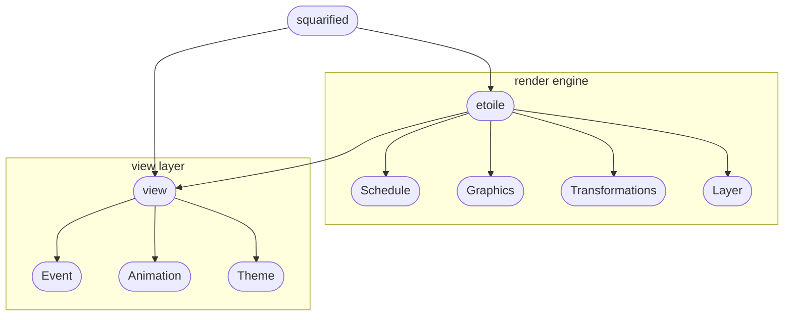

# Architecture Documentation

This document covers how `Squarified` works. It's intended to aid in understanding the code, in understanding what tricks `Squarified` use to improve performance.

Note this project is self-gratification so it have been made differently than other `treemap` component. The way things work now is not necessarily the best way of doing things.

### Design Principles

- **Use a simple render engine manage your application**

Most of `treemap component` which don't base on `2D render engine` or `svg render engine` often using canvas or svg primitive command to draw. (It can make logic hard to read) If the scene is simple enough, it's fine but is difficult to do optimize.

- **Split your canvas as multiple layer**

For example, you want to draw a background with a lot of stars and the background won't change. So we can split this scene with two layer. One is background the other is star collection.
When we update us star collection the background layer can skip update. If the star layer do animation we can save a lot of unnecessary rendering to improve performance.

- **Cache everything as possible**

Like offset Sceen and other can cache thing. Use them as much as possible to reduce drawing.

## Overview

### Etoile

`etoile` is a simple 2D render engine only contain basic `2D Matrix transform` and simple `graphics` and `layer`. As you see
it's very simple and is just an abstraction of the original command.

### View

`view` is in the `primitives` directory, it contain `event`,`animation`, and other use in `treemap` functions.

### Note about view

`component` is the core for `primitives` directory. we split render with those part. `drawBackgroundNode`、`drawForegroundNode`、`highlight view`、
`cache with background`. First we draw the treemap with `drawBackgroundNode` and `drawForegroundNode` then we called us render engine to update the
view.(It will cache the `backgroundNode` by using `drawImage`) so that when we trigger `wheel` and `drag`. we only reset `foreground` and do transform
for cache. When we trigger highlight. we only draw a highlight mask in `highlight view` the anoher canvas won't be update. so it quick.
