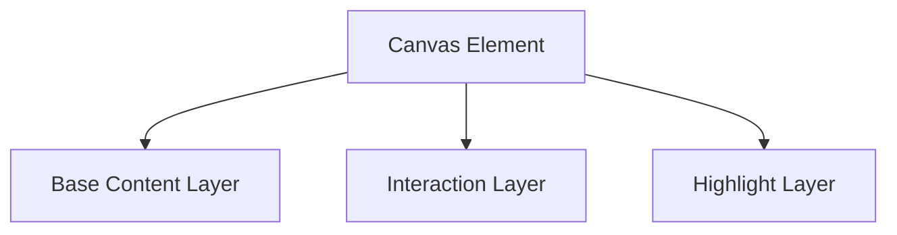
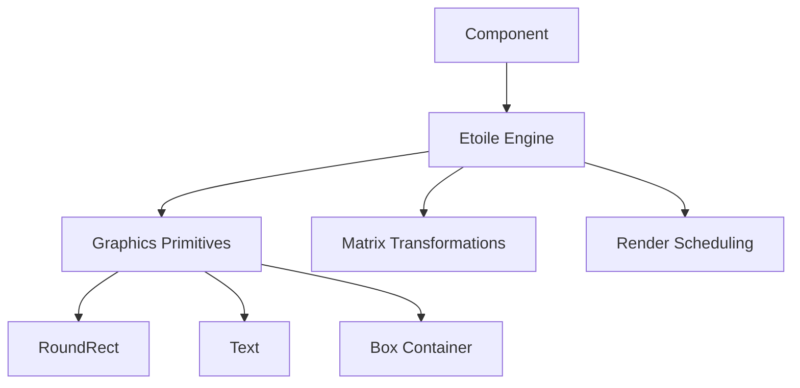
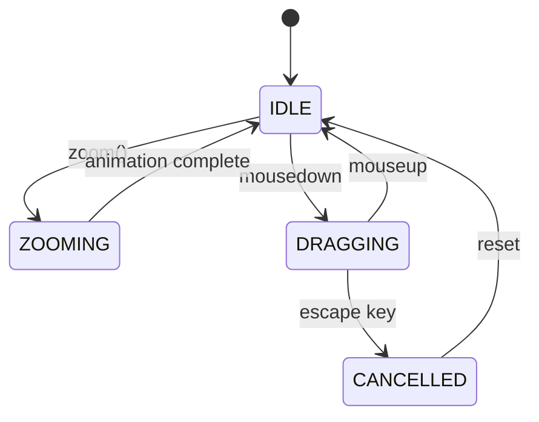
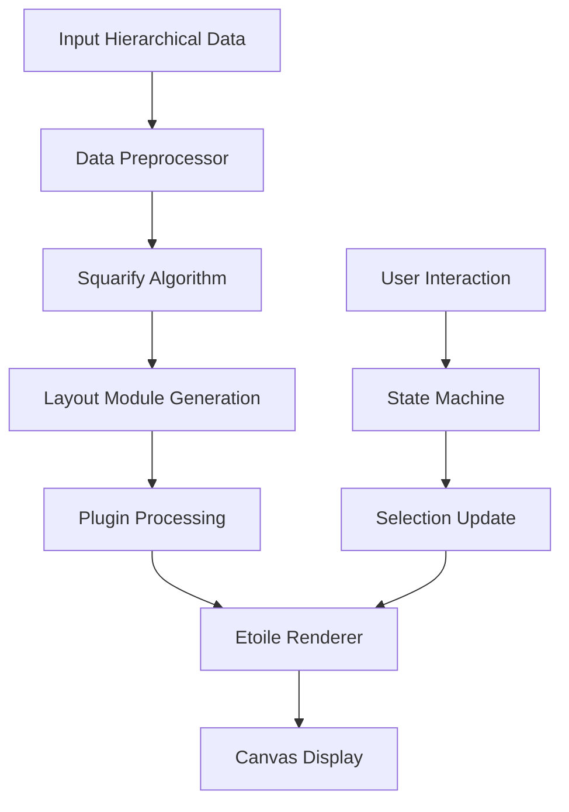

# Squarified Architecture Documentation

This document describes the architecture of `squarified`, explaining its design principles, core components, and optimization techniques.

## Core Design Principles

### 1. Layered Rendering Architecture

Squarified implements a multi-layered rendering approach that logically separates different visualization concerns:



**Benefits:**

- **Selective Updates**: Each layer can be updated independently, avoiding costly full redraws
- **Performance Optimization**: The highlight layer can animate without affecting static content
- **Render Isolation**: User interactions (hovering, selection) don't trigger unnecessary redraws of stable content
- **Visual Separation**: Clear separation between base content, interactive elements, and highlighting

### 2. Etoile: A Purpose-Built Rendering Engine

Squarified uses a dedicated rendering engine called "Etoile" that abstracts Canvas API complexity:



**Benefits:**

- **Abstracted Rendering**: Replaces direct Canvas API calls with a maintainable object model
- **Composition**: Creates reusable, composable rendering units
- **Transformation Management**: Simplifies matrix-based transformations
- **Performance Optimizations**: Implements specialized rendering techniques for treemaps
- **Render Batching**: Groups similar operations for better performance

### 3. Plugin-Based Architecture

The core system is kept minimal and stable, with functionality added through a plugin system:

```typescript
export const presetColorPlugin = definePlugin({
  name: 'treemap:preset-color',
  onModuleInit(modules) {
    // Logic isolated in plugin
  }
})
```

**Current plugins:**

- `preset-color`: Handles color assignment for treemap nodes
- `highlight`: Manages node highlighting during interactions
- `zoomable`: Controls zoom behavior and animations
- `drag`: Implements drag interaction
- `wheel`: Handles scroll wheel navigation

**Benefits:**

- **Core Stability**: Plugin isolation prevents bugs in extensions from affecting the rendering core
- **Logic Separation**: Each functional area is encapsulated in its own plugin
- **Independent Testing**: Plugins can be tested in isolation
- **Extensibility**: New features can be added without modifying core code
- **On-demand Loading**: Plugins can be loaded only when needed

### 4. State Machine for Interaction Management

Instead of complex conditional logic for handling interactions, Squarified employs a robust state machine:



**Benefits:**

- **Conflict Prevention**: Eliminates gesture conflicts (e.g., simultaneous drag and zoom)
- **Predictable Behavior**: Clearly defines allowed state transitions
- **Maintainable Logic**: Reduces complex conditional branches
- **Debugging**: State transitions are easily traceable
- **Extensibility**: New interaction modes can be added with minimal changes

### 5. Advanced Caching Strategies

Squarified implements multiple caching techniques to optimize performance:

#### Measurement Caching

Text measurement operations (particularly expensive in Canvas) are cached:

```typescript
// Font measurement cache
const fontMeasureCache = new Map<string, TextMetrics>()
```

#### Binary Search for Optimal Sizing

Font size calculation uses binary search algorithms to efficiently find optimal text sizing:

```typescript
function findOptimalFontSize(text, maxWidth, minSize, maxSize) {
  // Binary search between minSize and maxSize
  // Significantly faster than linear approaches
}
```

#### Layout Result Memoization

Node layout calculations are memoized to avoid recomputation during animations:

## Data Flow Pipeline



## Performance Considerations

1. **Adaptive Detail Rendering**:
   - Small nodes are automatically combined to reduce rendering load
   - Detail level adjusts based on zoom level and available space

2. **Incremental Updates**:
   - Only changed parts of the visualization are redrawn
   - The component implements diffing to identify changed nodes

3. **Optimized Text Rendering**:
   - Text is only rendered when it will be visible and legible
   - Labels are cached and reused when possible

4. **Event Throttling and Debouncing**:
   - Intensive operations like resizing and scrolling are throttled
   - Expensive recalculations are debounced during rapid interactions

## Future Considerations

1. **WebGL Acceleration**: For extremely large datasets
2. **Worker-based Layout**: Moving intensive calculations off the main thread
3. **Virtual Rendering**: Only rendering visible portions of large treemaps
4. **Further Plugin Isolation**: Reducing coupling between plugins

By implementing these architectural patterns, Squarified achieves both a maintainable codebase and high-performance visualizations for hierarchical data.
