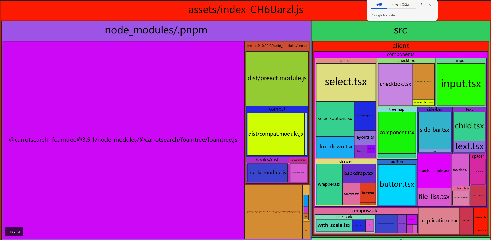

# Squarified

`squarified` is a minimal and powerful treemap component.



## Install

```shell
$ yarn add squarified
```

## Usage

See the dev directory for a minimal example.

### API

```ts
// convert data into expected data
declare function c2m<
  T extends AnyObject & {
    groups: any[]
  },
  K extends keyof T
>(data: T, key: K, modifier?: (data: T) => T): T & {
  weight: number
}

// preset theme layout (unstable)
declare function presetDecorator(app: TreemapLayout): void

declare function getNodeDepth(node: NativeModule): number

declare function visit<T extends AnyObject>(data: T[], fn: (data: T) => boolean | void): T | null

declare function findRelativeNode(p: {
  x: number,
  y: number
}, layoutNodes: LayoutModule[]): LayoutModule | null

declare function findRelativeNodeById(id: string, layoutNodes: LayoutModule[]): LayoutModule | null

interface App {
  init: (el: HTMLElement) => void
  dispose: () => void
  setOptions: (options: TreemapOptions) => void
  resize: () => void
  use: (using: Using, register: (app: TreemapLayout) => void) => void
  zoom: (id: string) => void
}

declare function createTreemap(): App
```

### Auth

Kanno

### LICENSE

[MIT](./LICENSE)
