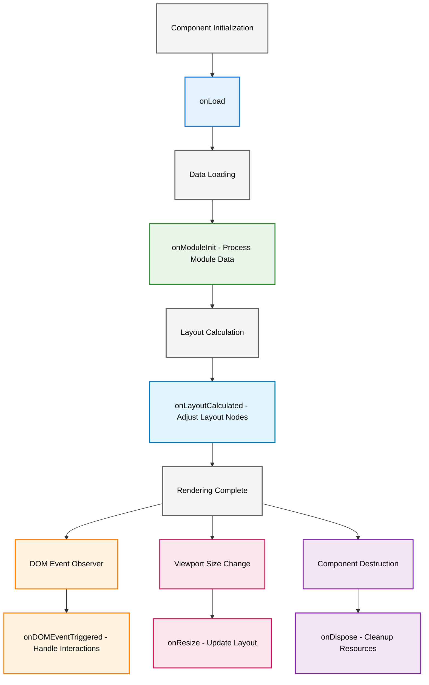

---

title: Plugins
level: 3

---

# Plugins

Squarified provide a serial of preset plugins.

- [presetColor](#preset-color)
- [presetHighlight](#preset-highlight)
- [presetDrag](#preset-drag)
- [presetContextMenu](#preset-context-menu)
- [presetScale](#preset-scale)
- [presetZoomable](#preset-zoomable)

## How to customize plugin?

squarified provide a function helper to declare a plugin.

```ts
import { definePlugin } from 'squarified'

export const plugin = definePlugin({
  name: 'plugin'
  //   ...hook
})
```

## Plugin Lifecycle Hooks



## Preset Color

Based on module id to generate rainbow colors.

```ts
import { createTreemap } from 'squarified'
import { presetColorPlugin } from 'squarified/plugins'

const treemap = createTreemap({
  plugins: [presetColorPlugin]
})
```

## Preset Highlight

Module highlight plugin.

```ts
import { createTreemap } from 'squarified'
import { presetHighlightPlugin } from 'squarified/plugins'

const treemap = createTreemap({
  plugins: [presetHighlightPlugin]
})
```

## preset Drag

Module dragable plugin.

```ts
import { createTreemap } from 'squarified'
import { presetDragElementPlugin } from 'squarified/plugins'

const treemap = createTreemap({
  plugins: [presetDragElementPlugin]
})
```

## preset Context Menu

Context menu plugin.

```ts
import { createTreemap } from 'squarified'
import { presetMenuPlugin } from 'squarified/plugins'

const treemap = createTreemap({
  plugins: [presetMenuPlugin]
})
```

## preset Scale

Module scale/wheel plugin.

```ts
import { createTreemap } from 'squarified'
import { presetScalePlugin } from 'squarified/plugins'

const treemap = createTreemap({
  plugins: [presetScalePlugin]
})
```

## preset Zoomable

Module zoom plugin.

```ts
import { createTreemap } from 'squarified'
import { presetZoomablePlugin } from 'squarified/plugins'

const treemap = createTreemap({
  plugins: [presetZoomablePlugin]
})
```
